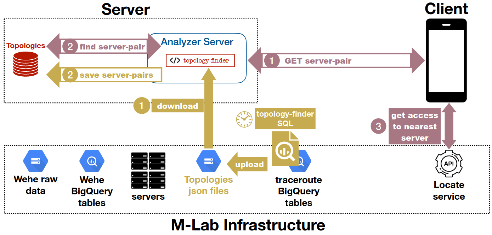

# WeHeY server deployment process

During the project we were working on verifying the server architecture to deploy the [WeHeY](https://github.com/NEU-SNS/wehe-py3/tree/WeHeY) extension to the [WeHe](https://wehe.meddle.mobi/codeanddata.html) application.

This verification is based on the architecture created by Zeinab Shmeis shown here: 

The verification was only on server side which mainly included testing whether the BigQuery creates correct output (topology-finder SQL in the figure), topologies preprocessing (download and server pairs in the image), and responding to the client with the right server pair.

## Testing BigQuery

### Downloading topologies

BigQuery SQL script is designed to run on M-Lab servers with write access rights. However, as we did not have them, we could not run the script such that it would write JSON files into the [Google storage buckets](https://console.cloud.google.com/storage/browser/archive-measurement-lab/wehe;tab=objects?pli=1&inv=1&invt=Ab0hIA&prefix=&forceOnObjectsSortingFiltering=false) owned by M-Lab. Thus, we modified the script to only use read rights (which anyone can obtain by subscribing to the M-Lab mailing list), so that all the subnets with created topologies would be piped into a single JSON local file. **(TODO: insert ref to download script)**

### Pre-pre-processing downloaded topologies

Created local file with all the subnets and their topologies would then be split into per-subnet JSON files, as it was intented in the initial SQL script. However, instead of BigQuery now uploading those JSON files into the Google storage buckets, and the server downloading them to have them locally, we have all of them locally immediately.

Limitation of this is that the server is scheduled to download topologies every 24 hours. However, with the current state, we need to manually run the script of downloading the topologies, such that server can then preprocess them.

## Testing topologies processing in the server

To test the topologies preprocessing, we created unit tests **(TODO: insert ref here)**, which check how the topologies are saved after they were verified and traceroutes gaps filled. 

The gaps need to be filled because we use HE, and IXP datasets to fill the AS names and numbers of those cases, where AS is either the upstream AS or is IXP AS. This part needs to work correctly, because we cannot do the Y test if we do not know every AS hop on the traceroute. Only with full traceroutes we say the topology is valid.

**(TODO: talk about the parts that were tested)**

## Testing server response

To test the server response, we ran the server in a Docker container and we tested the client on localhost and from a different machine with the topologies taken from different subnet (and modifying it such that the subnet could match). It responded with correct results.

## End product

We have built the [Docker image](https://hub.docker.com/repository/docker/mrimk/wehey-local-server/general), which contains the script to run BigQuery and pipe the output to a local file, and run the server in as a local environment. The docker container always starts by it starts downloading the topologies of that day. If the docker container is started with the flag `--run-server`, it immediately starts the server after running the query. Otherwise, it enters the shell from which the tests can be run and server can be started manually.

## Things left to be tested

Once the access from the measurement lab is granted for us to run the BigQuery on the Google servers and store the JSON files in the Google storage buckets, we need to test the download of the server. Once that is done, we can say that the server works correctly.
